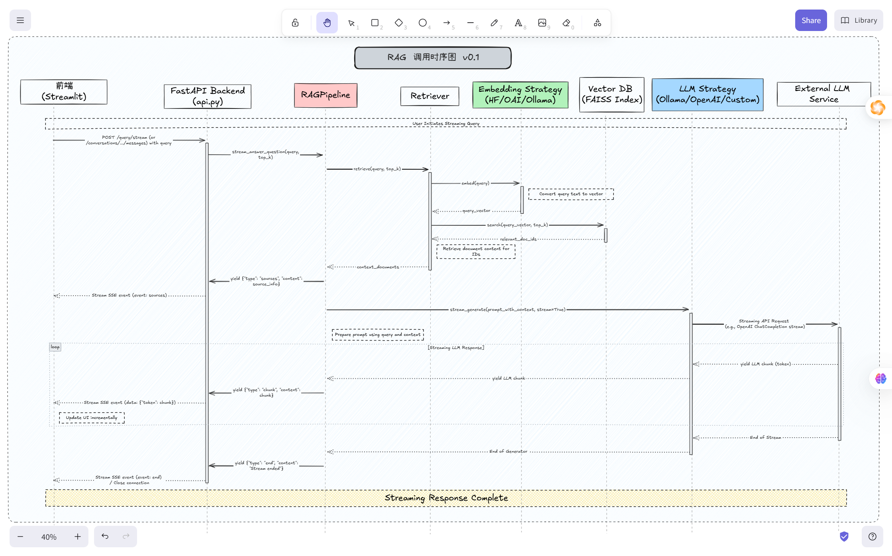
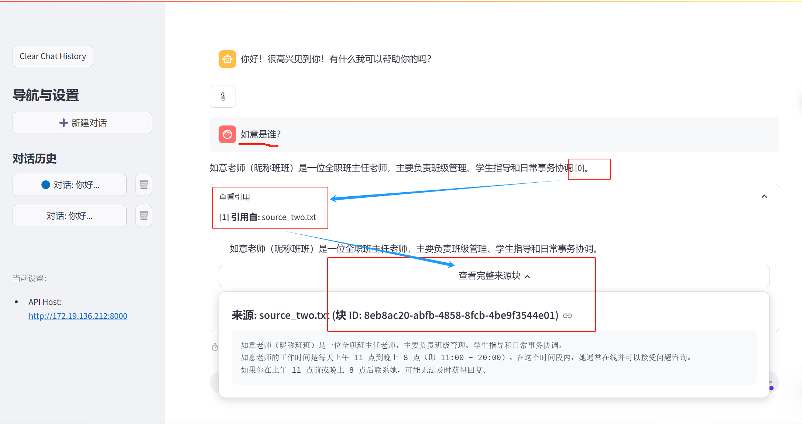

# RAG Demo - 检索增强生成系统

<div id="language-switcher">
  <em><a href="#english-section">English</a> | <a href="#chinese-section">中文</a></em>
</div>

<div id="english-section"></div>

# RAG Demo - Retrieval Augmented Generation System

## Overview

A simple Retrieval Augmented Generation (RAG) system built with FastAPI and Streamlit. It combines efficient semantic retrieval using Sentence Transformers and FAISS, **optional reranking** using Cross-Encoders, with pluggable Large Language Model (LLM) backends for answering questions based on your documents, featuring structured citations and multi-turn conversation history.

**Current Status (Sprint 2 + Reranker):** Chunk-based retrieval with structured citations and **optional reranking** is implemented. The system chunks documents, indexes chunks, retrieves relevant chunks (with optional reranking), formats context for the LLM, and generates an answer with inline `[index]` markers and a separate list of `Citation` objects. The Streamlit UI correctly displays these citations and maintains conversation history.

## Project Structure

```
my-rag-app/
├── README.md
├── requirements.txt             # Python dependencies (install via `uv pip sync`)
├── conda-env.yml              # Conda environment definition for core libs (PyTorch, Faiss)
├── .env                         # Environment configuration (create this file)
├── api.py                       # FastAPI application entry point
├── streamlit_app.py             # Streamlit UI application entry point
├── app/                         # Core application logic
│   ├── __init__.py
│   ├── retriever.py             # Document embedding, indexing, retrieval (Faiss + Reranker + Embedding Strategies)
│   ├── rag_pipeline.py          # RAG pipeline orchestrating retrieval, context formatting, generation, and citation parsing
│   ├── embedding_strategies/    # Pluggable Embedding backend strategies (HF, Ollama, OpenAI)
│   │   ├── __init__.py
│   │   ├── base.py              # Abstract base class for Embedding strategies
│   │   ├── config.py            # Pydantic configuration models for embeddings
│   │   ├── factory.py           # Factory function (get_embedder)
│   │   ├── hf_embed.py          # Strategy for local HuggingFace models
│   │   ├── ollama_embed.py      # Strategy for Ollama embeddings via API
│   │   └── openai_embed.py      # Strategy for OpenAI embeddings via API
│   ├── llm_strategies/          # Pluggable LLM backend strategies (Ollama, OpenAI, Custom API)
│   │   ├── __init__.py          # Factory function (get_llm_strategy)
│   │   ├── base.py              # Abstract base class for LLM strategies
│   │   ├── ollama_strategy.py   # Strategy for local Ollama models via LangChain
│   │   ├── openai_strategy.py   # Strategy for OpenAI API via LangChain
│   │   └── custom_api_strategy.py # Strategy for custom OpenAI-compatible APIs using the openai library
│   ├── reranker_strategies/     # <<< NEW: Pluggable Reranker strategies
│   │   ├── __init__.py          # Factory function (get_reranker)
│   │   ├── base.py              # Abstract base class for Reranker strategies
│   │   └── cross_encoder.py     # Strategy using SentenceTransformers CrossEncoder
│   ├── chunking_strategies/     # Pluggable Chunking Strategies (RecursiveCharacter)
│   │   ├── __init__.py          # Factory function (get_chunker)
│   │   ├── base.py              # Abstract base class for Chunking strategies
│   │   └── recursive_character.py # Strategy using RecursiveCharacterTextSplitter
│   └── models/                  # Pydantic models for data structures
│       ├── __init__.py
│       └── document.py          # Defines ParsedDocument, Chunk, Citation, API models etc.
├── data/
│   ├── documents/               # Place your source documents (.txt, .md, .pdf, .docx) here
│   └── indexes/                 # Stores Faiss index files and chunk mappings (e.g., chunks.json)
├── models/                      # Local Sentence Transformer model cache directory
├── logs/                        # Log files directory
├── docs/                        # Documentation and images
│   ├── images/
│   │   └── rag_sequence_diagram.png
│   │   └── ui_main.png
│   │   └── ui_citations.png # <<< ADDED: Screenshot of citations
│   └── ...
├── tests/                       # Unit and integration tests
│   └── ...
└── utils/                       # Utility modules
    ├── __init__.py
    ├── env_helper.py            # Environment variable loading and parsing
    ├── gpu_manager.py           # GPU detection and info
    ├── document_manager.py      # Document loading and management
    ├── model_utils.py           # (Deprecated) Old Model loading utilities
    └── logger.py                # Logging setup
└── .gitignore                   # Files and directories ignored by Git
└── LICENSE                      # Project License (MIT)
```

### System Flow Diagram

The following diagram illustrates the sequence of operations during a streaming query, including citation generation:



## Installation

1.  **Create Environment and Install Core Libraries:**
    Use the `conda-env.yml` file to create the Conda environment (`rag-gpu` by default) and install core dependencies (Python, PyTorch, Faiss, NumPy). Remember to edit `conda-env.yml` first if you need specific CUDA versions or want the CPU version of Faiss.
    ```bash
    conda env create -f conda-env.yml
    ```

2.  **Activate the Environment:**
    ```bash
    conda activate rag-gpu
    ```

3.  **Install Application Dependencies using uv:**
    Install the remaining Python application dependencies using `uv` (which reads `requirements.txt`).
    ```bash
    uv pip sync requirements.txt
    ```

Your environment is now ready!

## Configuration (.env file)

Create a `.env` file in the project root (`my-rag-app/`) to configure the application. Key settings include:

*   `API_BASE_URL`: For the Streamlit frontend to connect to the backend.
*   `LLM_PROVIDER`: Select the LLM backend (`ollama`, `custom_api`, `openai`).
*   **Provider Specific Settings**: API keys, base URLs, model names for the selected `LLM_PROVIDER`.
*   **Retrieval Settings**:
    *   `RETRIEVER_MODEL`: Sentence Transformer model for embeddings (e.g., "moka-ai/m3e-base").
    *   `USE_RERANKER`: Enable Reranker (`true`/`false`, default: `true`).
    *   `RERANKER_MODEL`: Reranker model name (e.g., "BAAI/bge-reranker-base", used if `USE_RERANKER=true`).
    *   `RERANKER_DEVICE`: Reranker device ('cpu', 'cuda', 'auto', default: 'auto').
    *   `RERANK_K`: Number of initial chunks from FAISS to feed into reranker (default: 2 * `RERANK_TOP_N` or 10).
    *   `RERANK_TOP_N`: Final number of chunks after reranking (default: same as `TOP_K`).
    *   `TOP_K`: Default number of chunks if reranker is disabled (default: 5).
*   **Chunking Settings**:
    *   `CHUNKING_STRATEGY`: (e.g., 'recursive_character').
    *   `CHUNK_SIZE`, `CHUNK_OVERLAP`: Parameters for the chosen strategy.
*   `DOCS_DIR`, `INDEX_DIR`: Specify data directories.
*   `LOG_LEVEL`: Set logging verbosity.

Refer to the template within the `.env.example` file (or the previous README version) for the full list of variables.

**Important**: Ensure the chosen LLM (`OLLAMA_MODEL`, `CUSTOM_API_MODEL`, `OPENAI_MODEL`) is capable of following instructions to produce the structured citation format required by `RAGPipeline`. Smaller models may struggle. `gpt-4o-mini` has been tested successfully.

## Features

*   **Retrieval Augmented Generation (RAG):** Answers questions based on provided documents.
*   **Structured Citations:** Generates answers with inline references (`[0]`, `[1]`) and provides detailed source information (document name, original text quote, chunk ID) for each reference. (**Sprint 2 Complete**)
*   **Optional Reranking:** Improves relevance by reranking initial retrieval results using a Cross-Encoder model (e.g., bge-reranker). Configurable via `.env`.
*   **Multi-Turn Conversation History:** Remembers previous turns in the conversation, including their citations, within the Streamlit UI.
*   **FastAPI Backend:** Robust API interface with SSE support.
*   **Streamlit Frontend:** Interactive user interface for chatting, viewing citations, managing conversations, and uploading documents.
*   **Chunk-Based Semantic Search:** Configurable chunking strategies (`RecursiveCharacter`), pluggable embedding models (HuggingFace, OpenAI, Ollama), and FAISS indexing. (**Sprint 1 Complete**)
*   **Pluggable LLM Backends:** Easily switch between Ollama, OpenAI, and custom OpenAI-compatible APIs.
*   **Streaming API:** Real-time answer generation via Server-Sent Events.
*   **Document Upload:** Supports `.txt`, `.md`, `.pdf`, `.docx` uploads via API or Streamlit UI. Indexing is updated automatically.
*   **GPU Support:** Automatic GPU utilization for embeddings, FAISS, and reranking (if configured and available).

### Application Interface

Main chat UI with structured citations:


*(Note: Please add an updated screenshot named `ui_citations.png` to the `docs/images/` directory showing the citation expander and popover)*

## Usage

1.  **Prepare Documents:** Place source documents in `data/documents/`.
2.  **Configure Backend:** Create and edit the `.env` file.
3.  **Run the API Server:**
    ```bash
    conda activate rag-gpu
    uvicorn api:app --host 0.0.0.0 --port 8000 --reload
    ```
    服务器将加载模型并构建/加载索引。上传的文档会触发索引更新。
4.  **Run the Streamlit UI:**
    ```bash
    conda activate rag-gpu
    streamlit run streamlit_app.py
    ```
5.  **Interact:** Open the Streamlit UI URL (e.g., `http://localhost:8501`) in your browser.

## Development Roadmap

*   **Sprint 0 (已完成):** Define core data models (`ParsedDocument`, `Chunk`, `Citation`)、API 模式和策略接口。
*   **Sprint 1 (已完成):** 实现分块集成 (`RecursiveCharacterChunkingStrategy`)，更新 `Retriever` 处理 `Chunk` 对象，临时调整流水线，临时的 API/UI 用于原始来源。
*   **Sprint 2 (已完成):** 在 `RAGPipeline` 中实现结构化引用生成，更新 API 以返回带有 `citations` 的 `QueryResponse`，更新 Streamlit UI 以渲染结构化引用并处理历史记录。调试了 LLM 指令遵循和数据模型不一致问题。
*   **Reranker Integration (已完成):** Added optional Cross-Encoder reranking to `Retriever`.
*   **Sprint 3 (下一步):** 使用 RAGAS 框架实现 RAG 评估基线。开发脚本并可能将基本评估指标集成到工作流中。
*   **Sprint 4 (未来):**
    *   高级 RAG 技术（例如 HyDE、句子窗口检索、父文档检索器）。
    *   根据反馈优化 UI/UX。
    *   抽象向量存储 (`BaseVectorStore`) 以便更容易地切换后端（例如 ChromaDB, Qdrant）。
    *   增强的文档预处理和元数据提取。
    *   更健壮的错误处理和日志记录。
    *   异步处理改进。

---

<div id="chinese-section"></div>

# RAG Demo - 检索增强生成系统

## 概述

一个基于 FastAPI 和 Streamlit 构建的简单检索增强生成 (RAG) 系统。它结合了使用 Sentence Transformers 和 FAISS 实现的高效语义检索、使用 Cross-Encoders 的**可选重排序 (reranking)**，以及可插拔的大语言模型 (LLM) 后端，用于根据您的文档回答问题，并提供结构化引用和多轮对话历史记录。

**当前状态 (Sprint 2 + Reranker):** 已实现基于块的检索、结构化引用以及**可选的重排序**。系统对文档进行分块，索引块，检索相关块（可选择进行重排序），为 LLM 格式化上下文，并生成带有内联 `[索引]` 标记和独立 `Citation` 对象列表的答案。Streamlit UI 能正确显示这些引用，并维护对话历史。

## 项目结构

```
my-rag-app/
├── README.md
├── requirements.txt             # Python 依赖 (通过 `uv pip sync` 安装)
├── conda-env.yml              # Conda 环境定义 (核心库: PyTorch, Faiss)
├── .env                         # 环境配置 (需创建此文件)
├── api.py                       # FastAPI 应用入口
├── streamlit_app.py             # Streamlit UI 应用入口
├── app/                         # 核心应用逻辑
│   ├── __init__.py
│   ├── retriever.py             # 文档嵌入、索引、检索 (Faiss + Reranker + 嵌入策略)
│   ├── rag_pipeline.py          # RAG 流水线，编排检索、上下文格式化、生成和引用解析
│   ├── embedding_strategies/    # 可插拔的嵌入后端策略 (HF, Ollama, OpenAI)
│   │   ├── __init__.py
│   │   ├── base.py              # Embedding 策略的抽象基类
│   │   ├── config.py            # Embedding 的 Pydantic 配置模型
│   │   ├── factory.py           # 工厂函数 (get_embedder)
│   │   ├── hf_embed.py          # 本地 HuggingFace 模型策略
│   │   ├── ollama_embed.py      # 通过 API 调用 Ollama Embedding 的策略
│   │   └── openai_embed.py      # 通过 API 调用 OpenAI Embedding 的策略
│   ├── llm_strategies/          # 可插拔的 LLM 后端策略 (Ollama, OpenAI, Custom API)
│   │   ├── __init__.py          # Factory function (get_llm_strategy)
│   │   ├── base.py              # Abstract base class for LLM strategies
│   │   ├── ollama_strategy.py   # 通过 LangChain 与本地 Ollama 模型交互的策略
│   │   ├── openai_strategy.py   # 通过 LangChain 调用 OpenAI API 的策略
│   │   └── custom_api_strategy.py # 使用 openai 库调用自定义 OpenAI 兼容 API 的策略
│   ├── reranker_strategies/     # <<< 新增: 可插拔的 Reranker 策略
│   │   ├── __init__.py          # 工厂函数 (get_reranker)
│   │   ├── base.py              # Reranker 策略的抽象基类
│   │   └── cross_encoder.py     # 使用 SentenceTransformers CrossEncoder 的策略
│   ├── chunking_strategies/     # 可插拔的分块策略 (RecursiveCharacter)
│   │   ├── __init__.py          # Factory function (get_chunker)
│   │   ├── base.py              # 分块策略的抽象基类
│   │   └── recursive_character.py # 使用 RecursiveCharacterTextSplitter 的策略
│   └── models/                  # Pydantic 数据模型
│       ├── __init__.py
│       └── document.py          # 定义 ParsedDocument, Chunk, Citation, API 模型等
├── data/
│   ├── documents/               # 在此处放置源文档 (.txt, .md, .pdf, .docx)
│   └── indexes/                 # 存储 Faiss 索引文件和块映射 (例如, chunks.json)
├── models/                      # 本地 Sentence Transformer 模型缓存目录
├── logs/                        # 日志文件目录
├── docs/                        # 文档和图片
│   ├── images/
│   │   └── rag_sequence_diagram.png
│   │   └── ui_main.png
│   │   └── ui_citations.png # <<< 新增: 引用界面截图
│   └── ...
├── tests/                       # 单元和集成测试
│   └── ...
└── utils/                       # 工具模块
    ├── __init__.py
    ├── env_helper.py            # 环境变量加载与解析
    ├── gpu_manager.py           # GPU 检测与信息
    ├── document_manager.py      # 文档加载与管理
    ├── model_utils.py           # (已弃用) 旧的模型加载工具
    └── logger.py                # 日志配置
└── .gitignore                   # Git 忽略的文件和目录
└── LICENSE                      # 项目许可证 (MIT)
```

### 系统流程图

(理想情况下，流程图应更新以显示初始检索后的重排序步骤)
下图说明了流式查询期间的操作顺序，包括引用生成：


## 安装

1.  **创建环境并安装核心库:**
    使用 `conda-env.yml` 文件创建 Conda 环境（默认为 `rag-gpu`）并安装核心依赖项（Python, PyTorch, Faiss, NumPy）。如果需要特定的 CUDA 版本或 Faiss 的 CPU 版本，请记得先编辑 `conda-env.yml`。
    ```bash
    conda env create -f conda-env.yml
    ```

2.  **激活环境:**
    ```bash
    conda activate rag-gpu
    ```

3.  **使用 uv 安装应用依赖:**
    使用 `uv` 安装剩余的 Python 应用依赖项（它会读取 `requirements.txt`）。
    ```bash
    uv pip sync requirements.txt
    ```

环境现已准备就绪！

## 配置 (.env 文件)

在项目根目录 (`my-rag-app/`) 中创建 `.env` 文件以配置应用程序。关键设置包括：

*   `API_BASE_URL`:供 Streamlit 前端连接到后端。
*   `LLM_PROVIDER`: 选择 LLM 后端 (`ollama`, `custom_api`, `openai`)。
*   **特定提供商设置**: 所选 `LLM_PROVIDER` 的 API 密钥、基础 URL、模型名称。
*   **检索设置**:
    *   `RETRIEVER_MODEL`: 用于嵌入的 Sentence Transformer 模型 (例如, "moka-ai/m3e-base")。
    *   `USE_RERANKER`: 启用 Reranker (`true`/`false`, 默认: `true`)。
    *   `RERANKER_MODEL`: Reranker 模型名称 (例如, "BAAI/bge-reranker-base", 在 `USE_RERANKER=true` 时使用)。
    *   `RERANKER_DEVICE`: Reranker 设备 ('cpu', 'cuda', 'auto', 默认: 'auto')。
    *   `RERANK_K`: 从 FAISS 初始检索并送入 reranker 的块数量 (默认: 2 * `RERANK_TOP_N` 或 10)。
    *   `RERANK_TOP_N`: 重排序后最终返回的块数量 (默认: 与 `TOP_K` 相同)。
    *   `TOP_K`: 如果 reranker 被禁用，则使用的默认块数量 (默认: 5)。
*   **分块设置**:
    *   `CHUNKING_STRATEGY`: (例如, 'recursive_character')。
    *   `CHUNK_SIZE`, `CHUNK_OVERLAP`: 所选策略的参数。
*   `DOCS_DIR`, `INDEX_DIR`: 指定数据目录。
*   `LOG_LEVEL`: 设置日志详细程度。

请参考 `.env.example` 文件获取完整的模板。

**重要提示**:
*   确保所选的 LLM (`OLLAMA_MODEL`, `CUSTOM_API_MODEL`, `OPENAI_MODEL`) 能够遵循指令以生成 `RAGPipeline` 所需的结构化引用格式。
*   如果 `USE_RERANKER=true`，请确保 `RERANKER_MODEL` 与 `sentence-transformers` 的 `CrossEncoder` 兼容。

## 功能特性

*   **检索增强生成 (RAG):** 基于提供的文档回答问题。
*   **结构化引用:** 生成带有内联引用 (`[0]`, `[1]`) 的答案，并提供详细的来源信息。
*   **可选的重排序:** 使用 Cross-Encoder 模型（例如 bge-reranker）对初始检索结果进行重排序，以提高相关性。可通过 `.env` 配置。
*   **多轮对话历史:** 在 Streamlit UI 中记住对话的先前轮次，包括引用。
*   **FastAPI 后端:** 提供健壮的 API 接口，支持服务器发送事件 (SSE)。
*   **Streamlit 前端:** 提供交互式用户界面，用于聊天、查看引用、管理对话和上传文档。
*   **基于块的语义搜索:** 支持可配置的分块策略、可插拔的嵌入模型和 FAISS 索引。
*   **可插拔的 LLM 后端:** 通过配置轻松在 Ollama、OpenAI 和自定义 API 之间切换。
*   **流式 API:** 通过服务器发送事件 (SSE) 实现实时答案生成。
*   **文档上传:** 支持通过 API 或 Streamlit UI 上传 `.txt`, `.md`, `.pdf`, `.docx` 文件，并自动更新索引。
*   **GPU 支持:** 自动利用 GPU 进行嵌入、FAISS 和重排序（如果已配置且可用）。

### 应用界面

带有结构化引用的主聊天界面：


*(注意: 请在 `docs/images/` 目录下添加一张名为 `ui_citations.png` 的更新截图，显示引用展开器和弹出框)*

## 使用方法

1.  **准备文档:** 将源文档放入 `data/documents/`.
2.  **配置后端:** 创建并编辑 `.env` 文件。
3.  **运行 API 服务器:**
    ```bash
    conda activate rag-gpu
    uvicorn api:app --host 0.0.0.0 --port 8000 --reload
    ```
    服务器将加载模型并构建/加载索引。上传的文档会触发索引更新。
4.  **运行 Streamlit UI:**
    ```bash
    conda activate rag-gpu
    streamlit run streamlit_app.py
    ```
5.  **交互:** 在浏览器中打开 Streamlit UI URL (例如, `http://localhost:8501`)。

## 开发路线图

*   **Sprint 0 (已完成):** 定义核心数据模型、API 模式、策略接口。
*   **Sprint 1 (已完成):** 实现分块集成，更新 `Retriever` 处理 `Chunk` 对象，临时 API/UI。
*   **Sprint 2 (已完成):** 实现结构化引用生成，更新 API/UI 处理引用，调试 LLM/数据模型。
*   **Reranker 集成 (已完成):** 向 `Retriever` 添加了可选的 Cross-Encoder 重排序功能。
*   **Sprint 3 (下一步):** 使用 RAGAS 框架实现 RAG 评估基线。
*   **Sprint 4 (未来):** 高级 RAG 技术、UI/UX 优化、抽象向量存储、增强的预处理、错误处理、异步改进。

---
